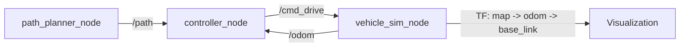

# Sparky

Sparky is a ROS 2 simulation workspace for basic autonomous vehicle planning, control, and vehicle-state feedback.

## Overview

The current workspace implements a minimum viable closed loop:
- `path_planner` publishes a fixed `nav_msgs/Path`
- `controller` tracks that path from `/odom` using a Pure Pursuit-style controller
- `vehicle_sim` simulates a kinematic bicycle model and publishes odometry plus TF
- `vehicle_description` provides the URDF asset for visualization

## Quick Start

Full environment setup is in [SETUP.md](SETUP.md).

Build the workspace:

```sh
colcon build
source install/setup.bash
```

Run the current nodes in separate terminals:

```sh
ros2 run path_planner path_planner_node
ros2 run controller controller_node
ros2 run vehicle_sim vehicle_sim_node
```

## Architecture

Current packages in `src/`:
- `path_planner`: publishes `/path`
- `controller`: subscribes to `/path` and `/odom`, publishes `/cmd_drive`
- `vehicle_sim`: subscribes to `/cmd_drive`, publishes `/odom`, broadcasts TF
- `vehicle_description`: installs the vehicle URDF asset

Runtime flow:



## Current Status

- Implemented: path publication, path tracking, kinematic simulation, odometry, and TF
- Missing: launch files, RViz config, metrics logging, route input, and trajectory smoothing
- Note: earlier project notes describe a `path_generator` and `planner` split, but the current source tree uses a single `path_planner` package

## Documentation

- [SETUP.md](SETUP.md): environment and dependency setup
- [docs/architecture.md](docs/architecture.md): package responsibilities and interfaces
- [docs/requirements.md](docs/requirements.md): current and target requirements
- [docs/implementation_status.md](docs/implementation_status.md): implementation gaps and risks

## Future Work

- Add launch files and an RViz configuration
- Replace the fixed square path with configurable route input
- Add trajectory smoothing and velocity profiling
- Add logging and plots for tracking metrics
- Clean up package metadata and runtime interfaces
