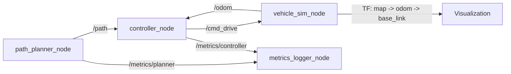

# Sparky

Sparky is a ROS 2 simulation workspace for basic autonomous vehicle planning, control, and vehicle-state feedback.

## Overview

The current workspace implements a minimum viable closed loop:
- `path_planner` publishes a configurable `nav_msgs/Path` from waypoint input parameters
- `controller` tracks that path from `/odom` using a Pure Pursuit-style controller
- `vehicle_sim` simulates a kinematic bicycle model and publishes odometry plus TF
- `vehicle_description` provides the URDF asset for visualization
- `metrics_logger` subscribes to planner and controller telemetry and writes CSV summaries

## Quick Start

Full environment setup is in [SETUP.md](SETUP.md).

Build the workspace:

```sh
colcon build
source install/setup.bash
```

Run the current nodes in three separate terminals:

```sh
ros2 run path_planner path_planner_node

ros2 run controller controller_node

ros2 run vehicle_sim vehicle_sim_node
```

Use the YAML planner route file to start the **path_planner** node:

```sh
ros2 run path_planner path_planner_node --ros-args \
      --params-file $(ros2 pkg prefix path_planner)/share/path_planner/config/default_route.yaml
```

Aternatively, you can override the planner route from the command line with your own flattened `x, y` waypoint pairs. For example:

```sh
ros2 run path_planner path_planner_node --ros-args \
      -p waypoints:="[0.0, 0.0, 3.0, 0.0, 3.0, 1.5, 0.0, 1.5, 0.0, 0.0]"
```

Manually start the RViz visualization:

```sh
rviz2
ros2 run robot_state_publisher robot_state_publisher \
      --ros-args \
      -p robot_description:="$(cat $(ros2 pkg prefix vehicle_description)/share/vehicle_description/urdf/vehicle.urdf)"
```

Or run this reusable RViz config:

```sh
rviz2 -d $(ros2 pkg prefix path_planner)/share/path_planner/rviz/sparky.rviz
```

Launch the stack with the default route file:

```sh
ros2 launch path_planner sparky.launch.py
```

Optional: Launch the stack without the metrics logger

```sh
ros2 launch path_planner sparky.launch.py enable_metrics:=false
```

Swap routes by pointing launch at another YAML file:

```sh
ros2 launch path_planner sparky.launch.py \
      route_config:=/absolute/path/to/your_route.yaml
```

Override the metrics output directory or summary period:

```sh
ros2 launch path_planner sparky.launch.py \
      metrics_log_dir:=/absolute/path/to/metrics \
      metrics_summary_period_s:=5.0
```

## Architecture

Current packages in `src/`:
- `path_planner`: publishes `/path` from configurable waypoint input
- `controller`: subscribes to `/path` and `/odom`, publishes `/cmd_drive`
- `vehicle_sim`: subscribes to `/cmd_drive`, publishes `/odom`, broadcasts TF
- `vehicle_description`: installs the vehicle URDF asset
- `metrics_logger`: subscribes to `/metrics/controller` and `/metrics/planner`, writes CSV logs

Runtime flow:



## Current Status

- Implemented: configurable path publication, path tracking, kinematic simulation, odometry, TF, manual RViz visualization, a checked-in RViz config, and CSV-backed controller/planner metrics logging
- Missing: trajectory smoothing, velocity profiling, and packaged metrics plotting

## Metrics

The launch path starts a metrics logger by default.

- Controller metrics topic: `/metrics/controller`
- Planner metrics topic: `/metrics/planner`
- Default CSV output directory: `metrics_logs/`
- Default summary log period: `2.0` seconds

The metrics logger writes:

- `metrics_logs/controller_metrics.csv`
- `metrics_logs/planner_metrics.csv`

The controller metrics CSV currently includes cross-track error, heading error, steering command, steering oscillation, commanded speed, curvature, control latency, lookahead distance, target point, and path size. The planner metrics CSV includes frame id, waypoint count, publish interval, and loop rate.

## Documentation

- [SETUP.md](SETUP.md): environment and dependency setup
- [docs/architecture.md](docs/architecture.md): package responsibilities and interfaces
- [docs/requirements.md](docs/requirements.md): current and target requirements
- [docs/implementation_status.md](docs/implementation_status.md): implementation gaps and risks

## Future Work

- Add trajectory smoothing and velocity profiling
- Add plotting or packaged analysis outputs for tracking metrics
- Extend route ingestion beyond parameter files and keep historical notes aligned with the current runtime
