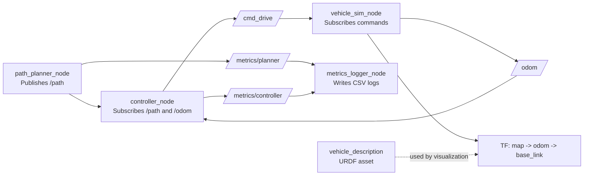

# Sparky Architecture

## Purpose
Sparky is a ROS 2 workspace for a small autonomous-driving simulation stack. The current codebase implements a minimum viable loop to:

1. Publish a path
2. Track that path with a controller
3. Simulate the vehicle state
4. Expose a simple vehicle model for visualization

## Current Workspace Layout
- `src/path_planner`: publishes a configurable `nav_msgs/Path` from waypoint parameters.
- `src/controller`: subscribes to path and odometry, publishes drive commands.
- `src/vehicle_sim`: simulates vehicle motion and publishes odometry plus TF.
- `src/vehicle_description`: installs the URDF for the simulated vehicle body.
- `src/metrics_logger`: subscribes to planner and controller telemetry and writes CSV logs plus summary lines.

## Runtime Topology


## Package Responsibilities

### `path_planner`
- Entry point: `path_planner_node`
- File: `src/path_planner/path_planner/path_planner_node.py`
- Publishes `/path` as `nav_msgs/Path`
- Current behavior: emits a parameter-driven waypoint path once per second in the configured frame

### `controller`
- Entry point: `controller_node`
- File: `src/controller/controller/controller_node.py`
- Subscribes to `/path` and `/odom`
- Publishes `/cmd_drive` as `geometry_msgs/Twist`
- Current behavior: pure-pursuit-style geometric tracking with a fixed lookahead distance and a speed reduction based on heading error

### `vehicle_sim`
- Entry point: `vehicle_sim_node`
- File: `src/vehicle_sim/vehicle_sim/vehicle_sim_node.py`
- Subscribes to drive commands
- Publishes `/odom` as `nav_msgs/Odometry`
- Broadcasts TF frames `map -> odom` and `odom -> base_link`
- Current behavior: kinematic bicycle model integration using commanded speed and steering

### `vehicle_description`
- No runtime node
- Asset package containing `urdf/vehicle.urdf`
- Current model: a simple box attached to `base_link`

### `metrics_logger`
- Entry point: `metrics_logger_node`
- File: `src/metrics_logger/metrics_logger/metrics_logger_node.py`
- Subscribes to `/metrics/controller` and `/metrics/planner`
- Current behavior: writes controller and planner CSV files and emits low-rate summary logs

## Interfaces

### Topics in Current Use
- `/path` (`nav_msgs/Path`): desired path from `path_planner`
- `/odom` (`nav_msgs/Odometry`): simulated vehicle state from `vehicle_sim`
- `/cmd_drive` (`geometry_msgs/Twist`): controller output consumed by `vehicle_sim`
- `/metrics/controller` (`diagnostic_msgs/DiagnosticArray`): controller telemetry for `metrics_logger`
- `/metrics/planner` (`diagnostic_msgs/DiagnosticArray`): planner telemetry for `metrics_logger`

### Frames in Current Use
- `map`
- `odom`
- `base_link`

The TF chain matches the README intent:

```text
map
└── odom
    └── base_link
```

## Architectural Notes
- The implemented runtime graph is simpler than the older repository design notes.
- The current planner publishes a configurable waypoint path directly; there is no trajectory smoothing or separate planning stage yet.
- `vehicle_sim` consumes `/cmd_drive` as its single command input.
- Launch and RViz assets now live under `src/path_planner` and provide a reproducible demo path.
- Package descriptions, dependencies, and license fields are now populated across the active packages.

## Suggested Near-Term Target Architecture
If the repo is brought in line with the original notes, the next stable architecture would likely be:

1. route or waypoint source,
2. path or trajectory generation,
3. tracking controller,
4. vehicle simulator,
5. launch and visualization assets that wire the system together.

That would restore the intended separation between path generation, planning, control, and plant simulation while keeping the current package boundaries mostly intact.